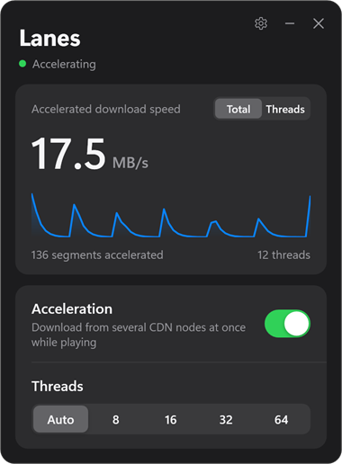
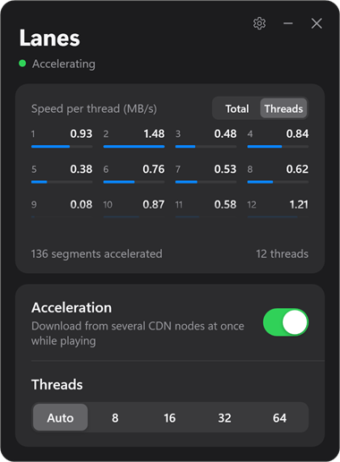
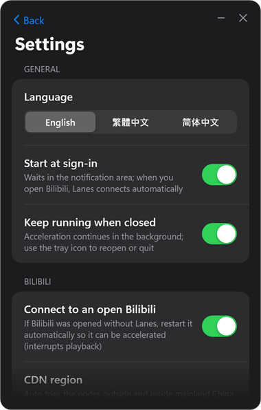
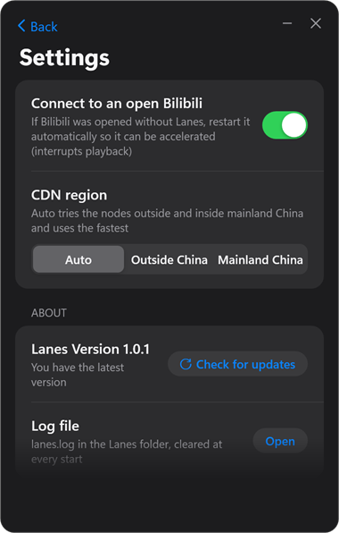

# Lanes

**English** · [繁體中文](README.zh-TW.md) · [简体中文](README.zh-CN.md)

Lanes is a portable Windows app that makes the official Bilibili desktop client download videos over many connections and CDN nodes at once.

Bilibili videos often stuttered for me, and BTR really solved that. I didn't want it installed inside the Bilibili client, so I used Claude to build this small standalone program.

**The acceleration is not Lanes' own work.** It is **[Bilibili-thread-ripper (BTR)](https://github.com/MrTangLuyao/Bilibili-thread-ripper)** by LouieTang ([MrTangLuyao](https://github.com/MrTangLuyao)). Lanes runs the page code of BTR's desktop edition, **[Bilibili-thread-ripper-desktop](https://github.com/MrTangLuyao/Bilibili-thread-ripper-desktop)**, unmodified, and only adds a separate window to control it. Lanes is an unofficial third-party project; BTR's author did not make or endorse it.

**BTR version used:** Bilibili-thread-ripper-desktop **0.9.4.2-d1** ([commit 80ff272](https://github.com/MrTangLuyao/Bilibili-thread-ripper-desktop/commit/80ff27254c354eaf8e87d1ff19124122691a9259)). Lanes follows BTR's desktop edition, not the browser one.

Lanes does not change any file of the Bilibili client, and when Lanes is closed the client downloads natively again.

<p>
  
  
  
  
</p>

## Features

- Live accelerated download speed, with a per-thread view (hover a cell to see its CDN node).
- On/off switch and thread count: Auto (BTR picks 8–32) or 8 / 16 / 32 / 64.
- Opening Lanes never opens Bilibili. While Lanes runs, a Bilibili you open the usual way is connected automatically (it restarts once, within seconds of opening, so Lanes can attach).
- Connects to a Bilibili that was already open before Lanes, too, by restarting it (interrupts playback). On by default; turn it off in settings.
- Start at sign-in, keep running in the notification area when the window closes.
- English (default), Traditional Chinese and Simplified Chinese interface.
- CDN region: Auto (default; tries the nodes outside and inside mainland China and uses the fastest), outside China, or mainland China.
- Looks for a new GitHub release 30 seconds after start and once a day, and tells you; it installs with one click when you choose.
- `lanes.log` in the Lanes folder, cleared at every start.

## Use

1. Download `Lanes-<version>.zip` from the [latest release](https://github.com/ChiaWei0804/lanes/releases/latest). The `-update` file next to it is only for in-app updates.
2. Extract it, put the `Lanes` folder anywhere (it is portable) and run `Lanes.exe`. It is not code-signed, so Windows may warn the first time: choose **More info → Run anyway**.
3. Open Bilibili as usual and play a video.

Requirements: Windows 10 or 11 (64-bit) and the official Bilibili desktop client. Nothing else to install: `node.exe` ships in the folder, and the window uses the .NET Framework built into Windows.

## Good to know

- Lanes attaches through the client's debugging port on `127.0.0.1:39229`, which only this computer can reach. While the client runs with it, other programs on this computer could use it too; it closes with the client.
- Whether acceleration helps depends on your network. When a single connection is already fast, the difference is small; BTR helps most when single connections are slow or stall.
- High thread counts are not always better: too many connections can make CDN nodes refuse them, and BTR then stops using those nodes until the next video. Auto is recommended.
- The update check asks `api.github.com` for this repository's latest release and sends nothing about you or your videos. If GitHub cannot be reached, the automatic check fails quietly.
- The web version of Bilibili is not covered by Lanes; for browsers, use [BTR's browser extension](https://github.com/MrTangLuyao/Bilibili-thread-ripper).

## Build from source

Needs Windows and Node.js 22 or later. In this folder:

```
node build.cjs             # builds Lanes.exe; copies the running node.exe here if none is present
node build.cjs --release   # also writes dist/Lanes-<version>.zip and dist/Lanes-<version>-update.zip for a GitHub release
node check.cjs             # self-checks
```

| Path | What it is |
| --- | --- |
| `btr-local.cjs` | Controller: attaches to the client, injects BTR, owns `settings.json`, takeover, updates, local API for the window |
| `app/Lanes.cs`, `app/ui.xaml` | The window (WPF), tray icon, settings page, log |
| `app/lang/*.json` | Interface text in English, Traditional Chinese and Simplified Chinese |
| `vendor/btr/` | BTR 0.9.4.2-d1 page files (commit 80ff272), unmodified, MIT license in `vendor/btr/LICENSE` |
| `version.json` | Version and the GitHub repository checked for updates |
| `docs/` | The screenshots in this README |

To publish version X.Y.Z: set it in `version.json`, run `node build.cjs --release`, create a GitHub release tagged `vX.Y.Z`, and attach `dist/Lanes-X.Y.Z.zip` and `dist/Lanes-X.Y.Z-update.zip`. The second one is the same without `node.exe` (about 0.1 MB); the in-app update downloads only that one while the installed Node is the one it was built with.

## Credits

All download logic — splitting, CDN node selection, retries, automatic thread count — comes from [Bilibili-thread-ripper](https://github.com/MrTangLuyao/Bilibili-thread-ripper) and [Bilibili-thread-ripper-desktop](https://github.com/MrTangLuyao/Bilibili-thread-ripper-desktop) by LouieTang (MIT). Lanes is an independent project and is not affiliated with BTR or Bilibili.

## License

Lanes' own code is under the [MIT License](LICENSE). The BTR files in `vendor/btr/` keep their own MIT license (`vendor/btr/LICENSE`).
