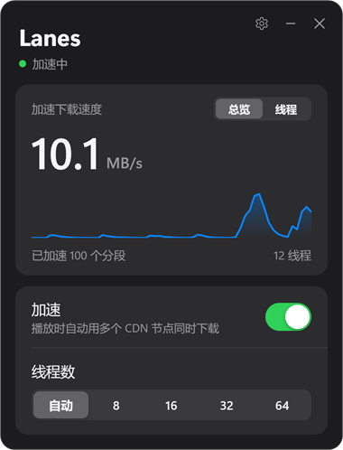
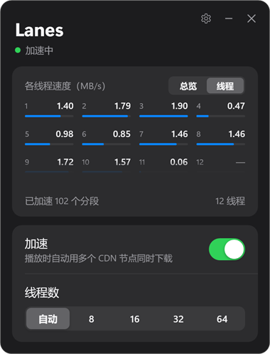
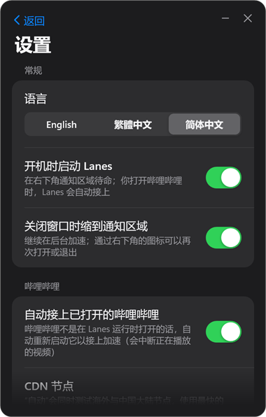
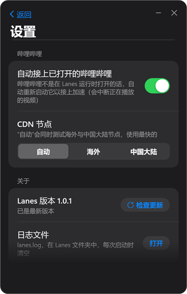

# Lanes

[English](README.md) · [繁體中文](README.zh-TW.md) · **简体中文**

Lanes 是一个便携式的 Windows 小程序，让官方哔哩哔哩桌面客户端用多条连接、多个 CDN 节点同时下载视频。

平常看 B 站常常卡，BTR 的出现确实解决了这个问题。因为不想把它装进哔哩哔哩客户端里，所以用 Claude 做了这个独立的小程序。

**加速功能不是 Lanes 做的**，而是 LouieTang（[MrTangLuyao](https://github.com/MrTangLuyao)）开发的 **[Bilibili-thread-ripper（BTR）](https://github.com/MrTangLuyao/Bilibili-thread-ripper)**。Lanes 原封不动地运行 BTR 桌面版 **[Bilibili-thread-ripper-desktop](https://github.com/MrTangLuyao/Bilibili-thread-ripper-desktop)** 的页面代码，只另外加上一个独立的操作窗口。Lanes 是非官方的第三方项目，并非 BTR 作者制作或认可。

**使用的 BTR 版本：** Bilibili-thread-ripper-desktop **0.9.4.2-d1**（[commit 80ff272](https://github.com/MrTangLuyao/Bilibili-thread-ripper-desktop/commit/80ff27254c354eaf8e87d1ff19124122691a9259)）。Lanes 跟随的是 BTR 的桌面版，而不是浏览器版。

Lanes 不会修改哔哩哔哩客户端的任何文件，关闭 Lanes 后客户端就回到原生下载。

<p>
  
  
  
  
</p>

## 功能

- 实时的加速下载速度，也可以切换成每个线程的速度（鼠标悬停在格子上会显示 CDN 节点）。
- 加速开关与线程数：自动（BTR 在 8–32 之间自行调整）或 8 / 16 / 32 / 64。
- 打开 Lanes 不会打开哔哩哔哩。Lanes 运行时，你照常打开的哔哩哔哩会自动接上（刚打开的几秒内会重启一次，让 Lanes 能接上）。
- 在 Lanes 之前就已打开的哔哩哔哩也会接上：自动重新启动它（会中断正在播放的视频）。默认开启，可以在设置中关闭。
- 开机时启动、关闭窗口时缩到通知区域继续运行。
- 界面语言：英文（默认）、繁体中文、简体中文。
- CDN 节点：自动（默认，同时测试海外与中国大陆节点，使用最快的）、海外或中国大陆。
- 启动 30 秒后以及之后每天自动检查 GitHub 有没有新版本，有的话会通知你；是否更新由你决定，点一下即可更新。
- 日志文件 `lanes.log` 在 Lanes 文件夹中，每次启动时清空。

## 使用

1. 到[最新发行版](https://github.com/ChiaWei0804/lanes/releases/latest)下载 `Lanes-<版本>.zip`；旁边带 `-update` 的文件只用于程序内更新。
2. 解压后把 `Lanes` 文件夹放在任意位置（便携式），运行 `Lanes.exe`。它没有数字签名，首次运行时 Windows 可能弹出警告，请点“更多信息”→“仍要运行”。
3. 照常打开哔哩哔哩、播放视频即可。

需求：Windows 10 或 11（64 位）与官方哔哩哔哩桌面客户端。无需另外安装任何东西：`node.exe` 就在文件夹里，窗口使用 Windows 自带的 .NET Framework。

## 需要知道的事

- Lanes 通过客户端的调试端口 `127.0.0.1:39229` 接上，只有这台电脑能连接。客户端带着这个端口运行时，这台电脑上的其他程序也能使用它；关闭客户端后端口随之关闭。
- 加速是否有帮助取决于你的网络。单一连接本来就很快时差别不大；单一连接慢或会卡住时，BTR 最有用。
- 线程数不是越多越好：连接太多会让 CDN 节点拒绝连接，BTR 会在下一个视频之前停用这些节点。建议使用“自动”。
- 身在中国大陆也可以在设置中直接选择“中国大陆”，省去测试海外节点。
- 检查更新只会向 `api.github.com` 查询这个仓库的最新发行版，不会发送你或视频的任何数据。在中国大陆可能连不上 GitHub，此时自动检查会安静地失败，不影响加速。
- Lanes 不支持网页版哔哩哔哩；浏览器请使用 [BTR 的浏览器扩展](https://github.com/MrTangLuyao/Bilibili-thread-ripper)。

## 从源码构建

需要 Windows 与 Node.js 22 及以上。在这个文件夹里运行：

```
node build.cjs             # 生成 Lanes.exe；文件夹里没有 node.exe 时，把正在运行的 node.exe 复制进来
node build.cjs --release   # 另外生成 GitHub 发行版要附上的 dist/Lanes-<版本>.zip 与 dist/Lanes-<版本>-update.zip
node check.cjs             # 自检
```

| 路径 | 说明 |
| --- | --- |
| `btr-local.cjs` | 控制程序：接上客户端、注入 BTR、保存 `settings.json`、自动接上、更新、给窗口用的本机 API |
| `app/Lanes.cs`、`app/ui.xaml` | 窗口（WPF）、通知区域图标、设置页、日志 |
| `app/lang/*.json` | 界面文字：英文、繁体中文、简体中文 |
| `vendor/btr/` | BTR 0.9.4.2-d1 的页面文件（commit 80ff272），未修改，MIT 许可证见 `vendor/btr/LICENSE` |
| `version.json` | 版本号，以及检查更新用的 GitHub 仓库 |
| `docs/` | 这份 README 里的截图 |

发布 X.Y.Z 版：在 `version.json` 修改版本号，运行 `node build.cjs --release`，在 GitHub 创建标签为 `vX.Y.Z` 的发行版，并附上 `dist/Lanes-X.Y.Z.zip` 与 `dist/Lanes-X.Y.Z-update.zip`。后者是不含 `node.exe` 的同一份内容（约 0.1 MB）；已安装的 Node 与打包时相同时，程序内更新只下载它。

## 致谢

所有下载逻辑（切分、CDN 节点选择、重试、自动线程数）都来自 LouieTang 的 [Bilibili-thread-ripper](https://github.com/MrTangLuyao/Bilibili-thread-ripper) 与 [Bilibili-thread-ripper-desktop](https://github.com/MrTangLuyao/Bilibili-thread-ripper-desktop)（MIT）。Lanes 是独立项目，与 BTR 及哔哩哔哩没有隶属关系。

## 许可证

Lanes 自己的代码采用 [MIT 许可证](LICENSE)。`vendor/btr/` 中的 BTR 文件沿用其自身的 MIT 许可证（`vendor/btr/LICENSE`）。
