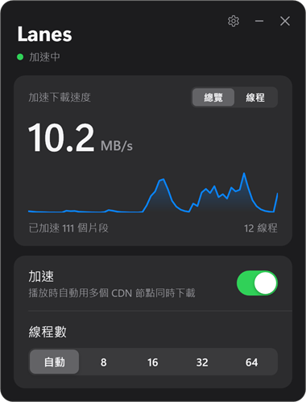
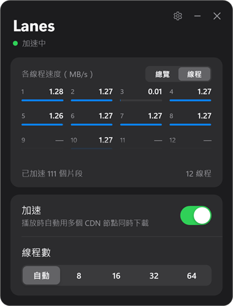
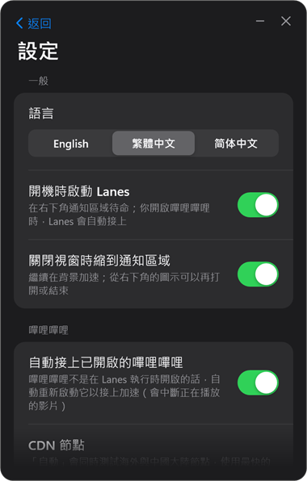
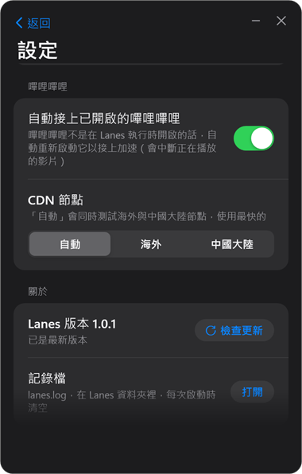

# Lanes

[English](README.md) · **繁體中文** · [简体中文](README.zh-CN.md)

Lanes 是一個可攜式的 Windows 小程式，讓官方嗶哩嗶哩桌面客戶端用多條連線、多個 CDN 節點同時下載影片。

平常看 B 站常常卡，BTR 的出現確實解決了這個問題。因為不想把它裝進嗶哩嗶哩客戶端裡，所以用 Claude 做了這個獨立的小程式。

**加速功能不是 Lanes 做的**，而是 LouieTang（[MrTangLuyao](https://github.com/MrTangLuyao)）開發的 **[Bilibili-thread-ripper（BTR）](https://github.com/MrTangLuyao/Bilibili-thread-ripper)**。Lanes 原封不動地執行 BTR 桌面版 **[Bilibili-thread-ripper-desktop](https://github.com/MrTangLuyao/Bilibili-thread-ripper-desktop)** 的頁面程式碼，只另外加上一個獨立的操作視窗。Lanes 是非官方的第三方專案，並非 BTR 作者製作或認可。

**使用的 BTR 版本：** Bilibili-thread-ripper-desktop **0.9.4.2-d1**（[commit 80ff272](https://github.com/MrTangLuyao/Bilibili-thread-ripper-desktop/commit/80ff27254c354eaf8e87d1ff19124122691a9259)）。Lanes 跟隨的是 BTR 的桌面版，不是瀏覽器版。

Lanes 不會修改嗶哩嗶哩客戶端的任何檔案，關掉 Lanes，客戶端就回到原生下載。

<p>
  
  
  
  
</p>

## 功能

- 即時的加速下載速度，也可以切換成每個線程的速度（滑鼠停在格子上會顯示 CDN 節點）。
- 加速開關與線程數：自動（BTR 在 8–32 之間自己調整）或 8 / 16 / 32 / 64。
- 開啟 Lanes 不會開啟嗶哩嗶哩。Lanes 執行時，你照平常方式開啟的嗶哩嗶哩會自動接上（剛開啟的幾秒內會重開一次，讓 Lanes 能接上）。
- 在 Lanes 之前就已開啟的嗶哩嗶哩也會接上：自動重新啟動它（會中斷正在播放的影片）。預設開啟，可以在設定中關閉。
- 開機時啟動、關閉視窗時縮到通知區域繼續執行。
- 介面語言：英文（預設）、繁體中文、簡體中文。
- CDN 節點：自動（預設，同時測試海外與中國大陸節點，使用最快的）、海外或中國大陸。
- 啟動 30 秒後與之後每天自動檢查 GitHub 有沒有新版本，有的話會通知你；要不要更新由你決定，按一下就能更新。
- 記錄檔 `lanes.log` 在 Lanes 資料夾裡，每次啟動時清空。

## 使用

1. 到[最新發行版](https://github.com/ChiaWei0804/lanes/releases/latest)下載 `Lanes-<版本>.zip`；旁邊帶 `-update` 的檔案只給程式內更新使用。
2. 解壓縮後把 `Lanes` 資料夾放在任何位置（可攜式），執行 `Lanes.exe`。它沒有數位簽章，第一次執行時 Windows 可能跳出警告，請按「其他資訊」→「仍要執行」。
3. 照平常方式開啟嗶哩嗶哩、播放影片即可。

需求：Windows 10 或 11（64 位元）與官方嗶哩嗶哩桌面客戶端。不需要另外安裝任何東西：`node.exe` 就在資料夾裡，視窗使用 Windows 內建的 .NET Framework。

## 需要知道的事

- Lanes 透過客戶端的除錯埠 `127.0.0.1:39229` 接上，只有這台電腦連得到。客戶端帶著這個埠執行時，這台電腦上的其他程式也能使用它；關掉客戶端就會關閉。
- 加速有沒有幫助取決於你的網路。單一連線本來就很快時差異不大；單一連線慢或會停頓時，BTR 最有用。
- 線程數不是越多越好：連線太多會讓 CDN 節點拒絕連線，BTR 會在下一支影片之前停用那些節點。建議用「自動」。
- 檢查更新只會向 `api.github.com` 查詢這個 repository 的最新發行版，不會傳送你或影片的任何資料。連不上 GitHub 時，自動檢查會安靜地失敗。
- Lanes 不支援網頁版嗶哩嗶哩；瀏覽器請使用 [BTR 的瀏覽器擴充功能](https://github.com/MrTangLuyao/Bilibili-thread-ripper)。

## 從原始碼建置

需要 Windows 與 Node.js 22 以上。在這個資料夾裡執行：

```
node build.cjs             # 產生 Lanes.exe；資料夾裡沒有 node.exe 時，把正在執行的 node.exe 複製進來
node build.cjs --release   # 另外產生 GitHub 發行版要附上的 dist/Lanes-<版本>.zip 與 dist/Lanes-<版本>-update.zip
node check.cjs             # 自我檢查
```

| 路徑 | 說明 |
| --- | --- |
| `btr-local.cjs` | 控制程式：接上客戶端、注入 BTR、保存 `settings.json`、自動接上、更新、給視窗用的本機 API |
| `app/Lanes.cs`、`app/ui.xaml` | 視窗（WPF）、通知區域圖示、設定頁、記錄檔 |
| `app/lang/*.json` | 介面文字：英文、繁體中文、簡體中文 |
| `vendor/btr/` | BTR 0.9.4.2-d1 的頁面檔（commit 80ff272），未修改，MIT 授權見 `vendor/btr/LICENSE` |
| `version.json` | 版本號，以及檢查更新用的 GitHub repository |
| `docs/` | 這份 README 裡的截圖 |

發布 X.Y.Z 版：在 `version.json` 改版本號，執行 `node build.cjs --release`，在 GitHub 建立標籤為 `vX.Y.Z` 的發行版，並附上 `dist/Lanes-X.Y.Z.zip` 與 `dist/Lanes-X.Y.Z-update.zip`。後者是不含 `node.exe` 的同一份內容（約 0.1 MB）；已安裝的 Node 和打包時相同時，程式內更新只下載它。

## 致謝

所有下載邏輯（切分、CDN 節點選擇、重試、自動線程數）都來自 LouieTang 的 [Bilibili-thread-ripper](https://github.com/MrTangLuyao/Bilibili-thread-ripper) 與 [Bilibili-thread-ripper-desktop](https://github.com/MrTangLuyao/Bilibili-thread-ripper-desktop)（MIT）。Lanes 是獨立專案，與 BTR 及嗶哩嗶哩沒有隸屬關係。

## 授權

Lanes 自己的程式碼採用 [MIT 授權](LICENSE)。`vendor/btr/` 裡的 BTR 檔案沿用它們自己的 MIT 授權（`vendor/btr/LICENSE`）。
